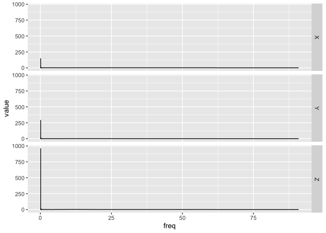

<!-- README.md is generated from README.Rmd. Please edit that file -->

# bis620.2022

[](https://github.com/hupidan98/bis620.2022/actions/workflows/R-CMD-check.yaml)
[](https://github.com/hupidan98/bis620.2022/actions/workflows/lint.yaml)
[](https://github.com/hupidan98/bis620.2022/actions/workflows/test-coverage.yaml)

This is the course project for BIS620. bis620.2022 project generte
accelerometry plot from 3-D accelerate data sets. Moreover, spectral
plots are generated. `ukb_accel` dataset (from UKBiobank) is included in
package.

## Installation

You can install the development version of bis620.2022 from
[GitHub](https://github.com/hupidan98/bis620.2022) with: <br>
`install.packages("devtools")` <br>
`devtools::install_github("hupidan98/bis620.2022")`

## Example

``` r
library('usethis')
library('devtools')
document()
#> ℹ Updating bis620.2022 documentation
#> ℹ Loading bis620.2022
library('bis620.2022')
## basic example code
data(ukb_accel)
ukb_accel[1:1000, ] |>
      spectral_signature() |>
      accel_plot()
```


